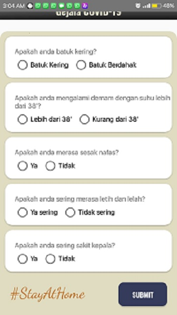

# challenge-2-Project-SMK-Coding
## Aplikasi Seputar Corona

Aplikasi tentang COVID-19
Sumber API : 

[title](https://covid19.mathdro.id/)

## Halaman Rasio

**Menampilkan update korban COVID-19 dari seluruh dunia.**

## Halaman Beranda

**Menampilkan berita berita seputar COVID-19.**

## Halaman Gejala

**Menyediakan layanan untuk pengecekan mandiri gejala COVID-19**

## Sekian Aplikasi dari saya terimakasih:)
